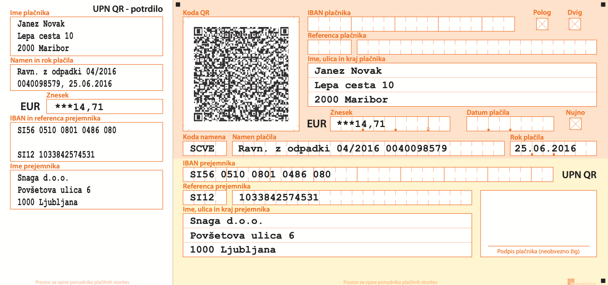

**Convert UPN Slovenian QR to EPC EU QR code format**

Use this project to convert UPN Slovenian QR code to EPC QR code format for SEPA payments (Revolut, N26, Wise etc.).
You can share scanned QR code between your devices.

#### Try it online: [https://upn-epc-qr.si/](https://upn-epc-qr.si//)

Build with:
- [Python](https://www.python.org/)
- [Django](https://www.djangoproject.com/)
- [HTMX](https://htmx.org/)
- [HTML5-qrcode](https://github.com/mebjas/html5-qrcode)
- [Pico css](https://picocss.com/)

